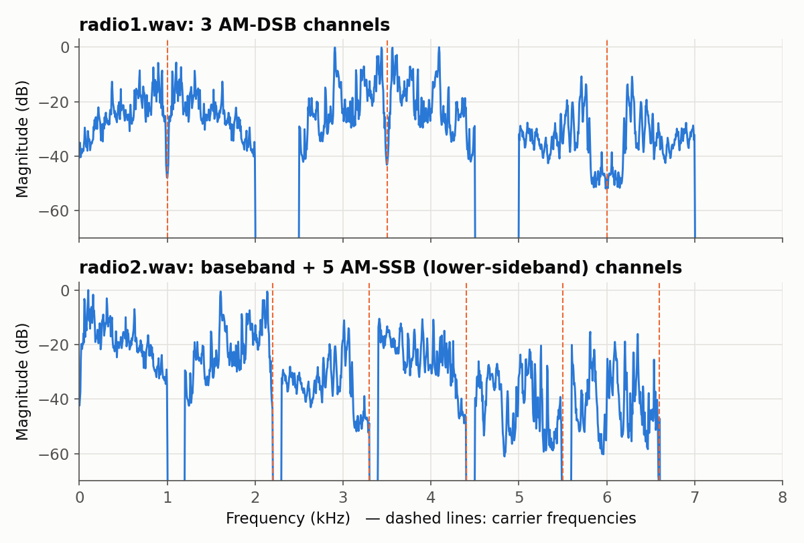

# Fourier Transforms in Analog & Digital Communications — Purdue × NCKU (MATLAB)

  
  
  
  

**English** | [繁體中文](README.zh-TW.md)

MATLAB projects from **Applications of Fourier Transforms on Analog and Digital Communications**
(傅立葉轉換在類比與數位通訊的應用, NCKU course 1142_E222400). This was an intensive NCKU–Purdue
short course (April–May 2026) taught in English by **Prof. Chih-Chun Wang (王之群)** of Purdue
University's Elmore Family School of Electrical and Computer Engineering.

The course starts from convolution and Fourier analysis and works up to real communication
systems. The code in this repo follows the same path:

| # | Folder | What it does | Signal-processing ideas |
|---|--------|--------------|-------------------------|
| 1 | [`project1-room-acoustics/`](project1-room-acoustics/) | Measures the impulse response of a real room with a hand clap, then convolves studio audio with it to make the audio sound as if it were played in that room | LTI systems, impulse response, convolution by FFT |
| 2 | [`project2-fourier-series/`](project2-fourier-series/) | Derives the Fourier-series coefficients of any periodic rectangular pulse, then rebuilds the signal from them | CTFS analysis/synthesis, time-shift property, Gibbs ringing |
| 3 | [`project3-am-radio/`](project3-am-radio/) | Builds a software AM radio: multiplexes several audio clips onto one signal, then tunes in to each channel | AM-DSB and AM-SSB modulation, FDM, ideal band-pass filters, coherent demodulation |
| 4 | [`digital-comm-tasks/`](digital-comm-tasks/) | In-class tasks that turn bit strings into analog waveforms | Pulse shaping, sinc pulses and zero ISI, sampling to a DAC array |

  

## Highlights

- **A software AM radio.** [`cmd1.m`](project3-am-radio/cmd1.m) and [`cmd2.m`](project3-am-radio/cmd2.m)
  pack 3 DSB channels and 6 SSB channels (1 baseband + 5 lower-sideband) into
  [`radio1.wav`](project3-am-radio/radio1.wav) and [`radio2.wav`](project3-am-radio/radio2.wav).
  [`AMDSB.m`](project3-am-radio/AMDSB.m) and [`AMSSB.m`](project3-am-radio/AMSSB.m) tune in to
  any one channel with a band-pass filter, a local carrier and a low-pass filter.
- **Real acoustic measurements.** We recorded the impulse responses of a library room and a
  stairwell. The stairwell's sound energy takes about twice as long to fall by 20 dB
  (0.37 s vs 0.18 s), which matches the stronger echo we heard in the convolved stairwell audio.
- **Filters built from first principles.** There is no Signal Processing Toolbox anywhere in this
  repo. Low-pass filters are written out as `2B·sinc(2Bt)` impulse responses, band-pass filters
  are the difference of two low-pass filters, and filtering is done by FFT-based convolution.

## Verification

Every script was re-run in GNU Octave 10.3 and its output compared with the files originally
submitted:

| Check | Result |
|-------|--------|
| `mainFunction.m` → `libraryConvolved.wav` | identical to the submitted file, sample for sample |
| `impulse_center.m` on `Library 1.wav` / `Stairwell 1.wav` | identical to the submitted centered impulse responses |
| `cmd1.m` / `cmd2.m` → `radio1.wav` / `radio2.wav` | identical to the committed files, sample for sample |
| `AMDSB(1..3)` | each output matches the correct source clip (correlation ≥ 0.998) and no other clip (\|corr\| < 0.02) |
| `AMSSB(1..6)` | each output matches the correct source clip and no other clip (\|corr\| < 0.02) |
| `student_own_program.m` coefficients a₀…a₆ | match numerical integration of the CTFS formula (max error 4 × 10⁻⁶) |
| `task15.m`, `task16.m` | samples at t = kT are exactly ±1, so the bit string can be read straight off the waveform |

## Written homework (not included)

Alongside the projects there were five problem sets, mostly from Oppenheim & Willsky. The
handwritten solutions are not published here. Topics covered:

| Set | Topics |
|-----|--------|
| HW1 | Calculus and arithmetic review: integrals, time shifting and scaling of CT/DT signals, partial fractions, trigonometry, complex numbers |
| HW2 | System properties such as linearity and time invariance (OW 1.27, 1.28, 1.31); harmonically related complex exponentials |
| HW3 | Convolution (OW 2.21, 2.22); a continuous-time moving-average system; how an LTI system responds to complex exponentials; orthonormal bases |
| HW4 | Continuous-time Fourier series (OW 3.21, 3.22) and signals from given coefficients |
| HW5 | Frequency response (OW 3.33); Fourier transforms of 2^−\|t\| and a rectangular pulse; the inverse transform of a band-limited spectrum; the ideal low-pass filter sin(2t)/πt; OW 4.32, 4.35 |

## Running the code

Each folder is self-contained. `cd` into it in MATLAB, then follow that folder's README.
Everything uses only base MATLAB (`fft`, `audioread`, `audiowrite`, `plot`). A few task scripts
call `xline`/`yline`, which need MATLAB R2018b or later.

Some input audio (the studio clip `x1.wav` and clips `x1`–`x6` for project 3) was provided by the
course and is **not** redistributed here. The pre-built radio signals `radio1.wav` / `radio2.wav`
are included, so the AM receivers run out of the box.

## Credits

- Course and assignment design: Prof. Chih-Chun Wang, Purdue University. The impulse-response
  experiment is adapted from Purdue ECE 301 material by Craig Manarik and Chih-Chun Wang.
  Course-provided helpers are marked as such in each folder's README.
- The projects were team work by **Adam Fan**, Edward Li, Ken Lian and Andy Zheng.
- Textbook: A. V. Oppenheim, A. S. Willsky and S. H. Nawab, *Signals and Systems*, 2nd ed.

Lecture notes, homework handouts and solutions are the instructor's material and are not included.
