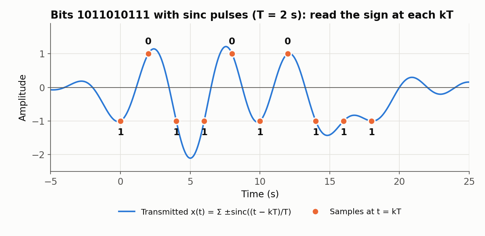

# Digital-communication tasks — from bits to waveforms

In-class team tasks from the course's digital-communication lectures (L201 *Basics of Digital
Communications*, L202 *Digital Implementation of Digital Communications*). They build up how a
transmitter maps bits onto analog waveforms and how that waveform becomes an array a DAC can
play.

  

| Script | Lecture / task | What it shows |
|--------|----------------|---------------|
| `task2.m` | L201 T2 | Single-bit waveform f1 = cos(4πt) over −4 ≤ t ≤ 4 (f0 = cos(2πt) is in the script, commented out) |
| `task5.m` | L201 T5 | Time-limited pulses: plots f0 = 1 on (0, 1); f1 = cos(2πt) on (0, 1) is defined alongside |
| `task7.m` | L201 T7 | Three bits sent as time-shifted f0/f1 pulses |
| `task12.m` | L201 T12 | 2 bits per symbol: four waveforms f00…f11 (cosines at 1–4 Hz); sends `01`, `10` with T = 2 s and marks the idle time this scheme wastes |
| `task14.m` | L201 T14 | One bit (b = 1) sent as −sinc(t/T), T = 2 s; zero crossings at every t = nT |
| `task15.m` | L201 T15 | 10 bits `0010101110`, a sum of shifted ±sinc pulses |
| `task16.m` | L201 T16 | 10 bits `1011010111`; sampling at t = kT reads the bits straight off the waveform (figure above) |
| `task9v2.m`, `task10v2.m` | L202 T10 | Bits `110` at 2 bit/s (T = 0.5 s) as a sinc-pulse waveform (the two files are identical) |
| `task13v2.m` | L202 T13 | Bits `0010110111` at 2 bit/s sampled at 20 Hz: builds the DAC array x_base[n] by direct substitution (101 samples over 0–5 s) |

**Why sinc pulses?** sinc(t/T) is 1 at t = 0 and exactly 0 at every other multiple of T. Adjacent
symbols can overlap in time, so the symbol rate is 1/T instead of being limited by pulse
duration, yet at the sampling instants t = kT only one pulse contributes. This is the zero
inter-symbol-interference (Nyquist) property. Running `task15.m` and `task16.m` confirms it: the
samples at kT are exactly ±1 and decode back to the transmitted bit strings.

`task13v2.m` gives x_base[0…9] = 1, 1.154, 1.293, 1.408, 1.490, 1.531, 1.525, 1.469, 1.361,
1.203 (from an Octave run).

## Run

Each file is a standalone script, e.g. `task16`. The sinc function is written out by hand, so no
toolbox is needed. `xline`/`yline` require MATLAB R2018b or later.
