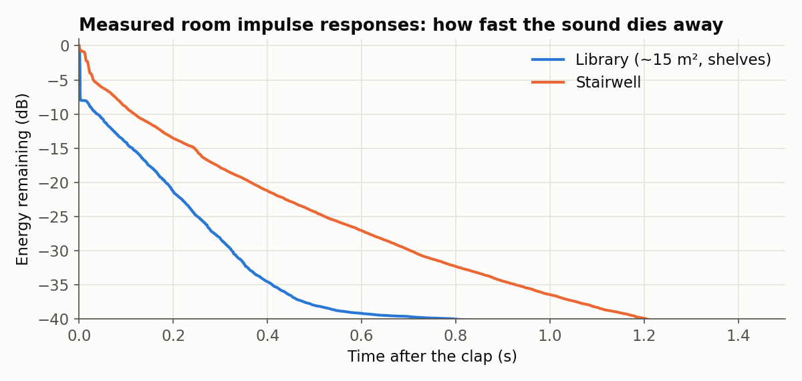

# Project 1 — Recreating a room's acoustics by convolution

**Idea.** A room behaves, to a good approximation, like an LTI system. If we know its impulse
response h(t), then any sound x(t) played in that room reaches the listener as
y(t) = x(t) ∗ h(t). We measured h(t) for two places by recording a single hand clap (a
"good-enough" impulse), then convolved a dry studio recording with it in MATLAB.

| Location | Recording | Observation (from our write-up) |
|----------|-----------|---------------------------------|
| Library, a small room of about 15 m² with shelves | `Library 1.wav` | Faint background noise, reduced low frequencies, no distinct echo |
| Stairwell | `Stairwell 1.wav` | Strong echo; the output sounds more spacious but less clear |

<p align="center">
  
</p>

The curves above come from the two centered impulse responses (Schroeder backward integration,
computed for this README). The stairwell takes 0.37 s to lose 20 dB of energy; the library takes
0.18 s.

## Files

| File | Origin | Purpose |
|------|--------|---------|
| `mainFunction.m` | ours | The pipeline: centers the impulse, loads the dry audio `x1.wav`, convolves, normalizes, writes `libraryConvolved.wav` |
| `impulse_center.m` | course-provided | Finds the clap (the sample with the largest amplitude) and cuts an 8-second window around it (±4 s at 44.1 kHz) → `new_file.wav` |
| `ece301conv.m` | course-provided | Linear convolution through the FFT: zero-pad both signals to 2N, multiply the spectra, take the centered N samples and scale by Δt, which approximates the continuous-time integral |
| `Library 1.wav`, `Stairwell 1.wav` | recorded by our team | Hand-clap impulse responses (44.1 kHz, mono, at least 4 s of silence on each side) |

## Run

```matlab
% needs the course-provided dry recording x1.wav (not redistributed) in this folder
mainFunction                        % -> new_file.wav, libraryConvolved.wav (and plays it)
```

To hear the stairwell, change the file name on the first line of `mainFunction.m` to
`'Stairwell 1.wav'`.
