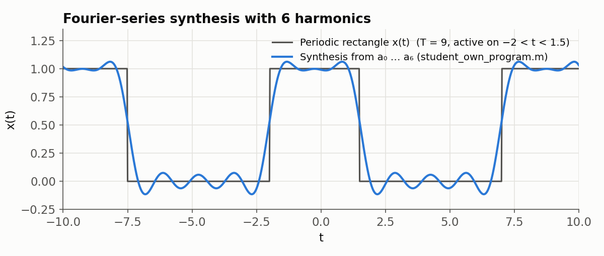

# Project 2 — Fourier series of a periodic rectangular pulse

**Idea.** A periodic rectangular pulse with period T that is "on" for `active_left < t < active_right`
is a shifted version of the textbook symmetric pulse. Its continuous-time Fourier series (CTFS)
coefficients therefore follow in closed form from the symmetric case plus the time-shift property:

```
a0 = (active_right − active_left) / T
ak = sin(k·ω0·T1) / (kπ) · e^(−j·k·ω0·t_shift),   ω0 = 2π/T
T1 = (active_right − active_left)/2,   t_shift = (active_left + active_right)/2
```

`student_own_program.m` implements exactly this for k = 0…6. `CTFS_synthesis.m` then rebuilds
x(t) = Σ ak·e^(jkω0t) from the coefficients, using conjugate symmetry so that only a0…a6 are
needed.

<p align="center">
  
</p>

With only six harmonics the reconstruction already follows the pulse. The ripple and the
overshoot of about 6 % near each edge are the Gibbs phenomenon. The coefficients agree with
direct numerical integration of the CTFS analysis formula to within 4 × 10⁻⁶.

## Files

| File | Origin | Purpose |
|------|--------|---------|
| `student_own_program.m` | ours | Closed-form CTFS coefficients a0…a6 for any period and pulse position |
| `test123.m` | ours | Driver script: T = 9, pulse on (−2, 1.5); plots the pulse together with its synthesis |
| `CTFS_synthesis.m` | course-provided | Synthesizes a real signal from a0…an |
| `peri_rect.m` | course-provided (this copy also has an extra cos-plotting block at the top) | Generates the periodic rectangle for comparison |

## Run

```matlab
total_range_left = -10; total_range_right = 10;   % test123 expects these in the workspace
test123
```
